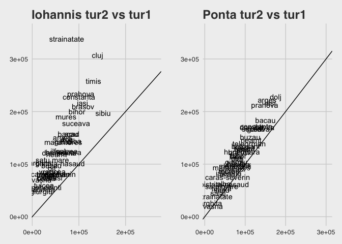
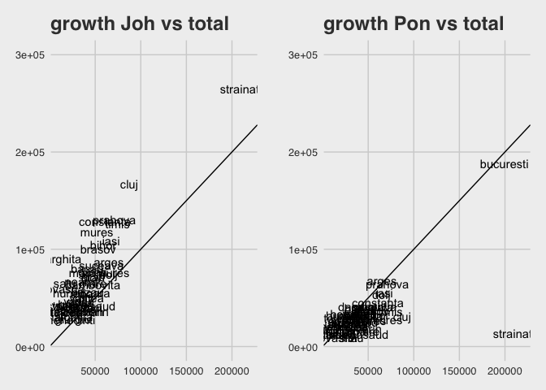
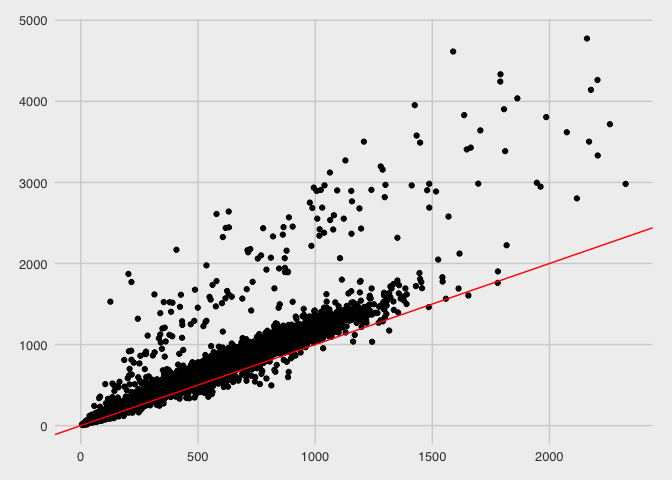

# The undecided
Theodor Balan  
24 Aug 2016  


## Context

In December 2016, parliamentary elections took place in Romania. A small grass-root party, Union Save Romania (USR) runs for elections for the first time, after a moderate success in running at the previous local elections in Bucharest earlier in 2016.
With a very short time to develop and limited resources for the campaign, the question is on which places in the country to focus on.

In December 2014, presidential elections took place in Romania. The leading goverment party at the time (PSD, social-democrats) was running with Mr. Ponta while the main opposition force (PNL, center-right liberal) was proposing Mr. Johannis. 
Mr. Ponta was clearly the favorite, enjoying a large support especially in rural and poor communities, and a much better organized campaign, with strong tendencies towards populism and nationalism. Mr. Johannis did not have a comparable image or support, but was widely respected for his tenure as a mayor in the city of Sibiu. Before the first round, Mr. Johannis had a rather weak media presence, and Mr. Ponta won by a landslide. Not enough to secure 50% of the votes, though.

In the first round, from around 9.67 mil votes, Mr. Ponta secured 3.93 mil (40.7%) while Mr. Johannis only 2.93 mil (30.2%). 
In the second round, a much higher turnout (11.78 mil), Mr Ponta had secured 5.39 mil (45.8%) and Mr. Johannis a whopping 6.38 mil (54.2%). 

There are several possible reasons why this has happened. Between the two rounds, Mr. Ponta mismanaged a scandal regarding the limitation of voting rights of Romanians living abroad, and Mr. Johannis' media presence improved. The public outrage against Mr. Ponta seems to have been the cause. The increase in the number of voters suggest that indeed, most new voters voted against Mr. Ponta. The highest increase in voting numbers was in urban centers and abroad, places which traditionally have a low-turnout and an aversion towards the PSD. 


```
## # A tibble: 15 × 5
##      candidat voturi_tur1 proc_tur1 voturi_tur2 proc_tur2
## *       <chr>       <int>     <dbl>       <int>     <dbl>
## 1    amaritei        8085      0.08          NA        NA
## 2      branza       43929      0.45          NA        NA
## 3  diaconescu      392156      4.05          NA        NA
## 4       funar       45939      0.47          NA        NA
## 5    iohannis     2930683     30.28     6386158      54.2
## 6     kelemen      331901      3.43          NA        NA
## 7     macovei      424816      4.39          NA        NA
## 8   melescanu      105228      1.09          NA        NA
## 9       ponta     3937692     40.69     5396882      45.8
## 10     rotaru       29634      0.31          NA        NA
## 11    szilagy       53550      0.55          NA        NA
## 12  tariceanu      515061      5.32          NA        NA
## 13      udrea      502347      5.19          NA        NA
## 14      vadim      356703      3.69          NA        NA
## 15      TOTAL     9677724     99.99    11783040     100.0
```
I call these people the *undecided*. They don't usually bother voting, but when they feel outraged they do so, even if it is to vote what they perceive as the lesser evil. 
USR appeals to these people. The party has a clear anti-PSD position and its members were not politicians previously. The question is: where are they?

## Assumptions
Mr. Johannis raised an extra 3.4 mil votes in the second round, while Mr. Ponta raised only 1.3 mil votes, as compared to the first round. The following statements are plausible:
  - Both candidates attracted other voters from the first round. For example, Mr. Tariceanu gave his support to Mr. Ponta. Mr. Diaconescu, a populist, had a similar appeal as Mr. Mr. Johannis atracted the voters of Mrs. Macovei, running on an anti-corruption platform, possibly some from Mrs. Udrea, an anti-PSD candidate. An ethnic minoritarian himsel, Johannis probably captured the votes of the hungarian minority as well.
  - Generally, I can assume that, more or less, the majority of the voters from the first round also casted a vote in the second round. 
  - The new voters casted their votes, very likely, to Mr. Johannis

Where are the *undecided*?

## Cateva figuri
Here I look at counties to see the evolution of the two candidates between the two rounds. Left it Mr. Johannis and right is Mr. Ponta, both showing the number of votes in the second round vs the number of votes in the first round. Mr. Johannis seems to have fared better in the second round, especially among the romanians outside romania, and in the counties of Cluj and Timis. Mr. Ponta has seem a rather modest increase in every county.   
<!-- -->

Here I look at the growth of each of the candidates vs the total growth in number of voters. 
This shows that Mr. Johannis' growth was above the total growth in each county, while Mr. Ponta's growth was below the number of new voters. 
<!-- -->

## Selectarea datelor

In 488 polling statiosn there were less voters in round 2 than in round 1. The larger decreases were seen in some towns from Harghita and Covasna (hungarian-majority regions), although overall the counties themselves enjoyed a growth in voters as well. 
<!-- -->

```
## # A tibble: 510 × 6
##        judet     localitate sectie_id  tur1  tur2  diff
##        <chr>          <chr>     <int> <int> <int> <int>
## 1  mehedinti       punghina     12718   813   496  -317
## 2   harghita       siculeni     10247   884   598  -286
## 3   harghita        remetea     10226   764   513  -251
## 4   harghita        remetea     10225   887   662  -225
## 5   harghita          cirta     10018   792   581  -211
## 6    giurgiu       ghimpati      9498  1243  1034  -209
## 7   harghita        remetea     10223   743   543  -200
## 8   harghita ciucsingeorgiu     10022   544   356  -188
## 9   harghita        danesti     10039   559   389  -170
## 10  harghita        remetea     10224   830   664  -166
## # ... with 500 more rows
```
Aggregating the votes on towns, in 88 towns there were less voters in the second round as compared to the first.


```
## Source: local data frame [88 x 5]
## Groups: judet [16]
## 
##        judet   localitate  tur1  tur2  diff
##        <chr>        <chr> <int> <int> <int>
## 1    giurgiu     ghimpati  4187  4001  -186
## 2   harghita      remetea  3224  2382  -842
## 3       dolj       cetate  3095  2990  -105
## 4   harghita        praid  2550  2231  -319
## 5   harghita       joseni  2445  2081  -364
## 6   harghita   sindominic  2271  1862  -409
## 7   harghita       corund  2227  2068  -159
## 8  teleorman      mosteni  2168  2158   -10
## 9   harghita lunca de jos  2141  1926  -215
## 10  harghita       lupeni  2029  1858  -171
## # ... with 78 more rows
```
I exclude these from the analysis. 

## The model
I am modeling the following scenario: a number of people vote in round 1 for their favourite candidates. In round 2, they also show up, plus a number of new voters. The new voters may come from the PSD-dominated regions (to vote pro-Ponta) or the **undecided**. If a person voted in round 1, then in round 2 they voted for one of the two candidates.

Assume that the growth of Mr. Johannis' votes is described by 
$$
\mathrm{iohannis}_\mathrm{tur2} - \mathrm{iohannis}_\mathrm{tur1} = 
\beta_1 \times ( \mathrm{total}_\mathrm{tur2} - \mathrm{total}_\mathrm{tur2}) + 
\beta_2 \times \mathrm{amaritei}_\mathrm{tur1} + \beta_3 \times \mathrm{branza}_\mathrm{tur1} + ... + \varepsilon
$$
with unknowns $\beta_i$, restricted on $0 \leq \beta_i \leq 1$. 
The interpretation is that the extra votes of mr. Johannis in round 2 consists of a proportion of the new votes plus a sum of proportions of votes of other candidates from round 1. A large $\beta_1$ is consistent in this case with a large number of **undecided**. For $\beta_1 = 0.7$ it would mean that Mr. Johannis attracted 70% of the extra voters from round 2.

I use quadratic programming to estimate the $\beta$:

```
##          variabila beta
## 1             incr 0.96
## 2    tur1_amaritei 0.00
## 3      tur1_branza 0.91
## 4  tur1_diaconescu 0.01
## 5       tur1_funar 1.00
## 6     tur1_kelemen 0.86
## 7     tur1_macovei 1.00
## 8   tur1_melescanu 0.93
## 9       tur1_ponta 0.00
## 10     tur1_rotaru 0.00
## 11    tur1_szilagy 1.00
## 12  tur1_tariceanu 0.00
## 13      tur1_udrea 1.00
## 14      tur1_vadim 0.08
```
According to this estimateion, Mr. Johannis attracted around 96% of the new voters from round 2 at a national level. Also, a large proportion of the votes of Branza, Kelemen, Macovei, Melescanu, Szilagy, Udrea. 
(and 100% of Funar's votes, an extreme-right candidate, difficult to believe. I will return to this.)

Then I do the same thing for each county.

```
## # A tibble: 43 × 10
##        judet voturi_noi      incr tur1_kelemen tur1_macovei tur1_melescanu
##        <chr>      <dbl>     <dbl>        <dbl>        <dbl>          <dbl>
## 1  mehedinti      22198 0.3332480    0.9219929            1      0.5363126
## 2  teleorman      30413 0.3514803    1.0000000            1      1.0000000
## 3   botosani      33086 0.3722928    1.0000000            1      0.3037307
## 4      buzau      41798 0.3915988    1.0000000            1      1.0000000
## 5   ialomita      24886 0.4011137    1.0000000            1      0.9328125
## 6       dolj      64627 0.4070619    0.2744306            1      1.0000000
## 7     vaslui      32374 0.4224075    0.0000000            1      1.0000000
## 8       gorj      32670 0.4254507    0.8173090            1      1.0000000
## 9      arges      64979 0.4271487    1.0000000            1      1.0000000
## 10      iasi      67407 0.4277684    1.0000000            1      1.0000000
## # ... with 33 more rows, and 4 more variables: tur1_ponta <dbl>,
## #   tur1_tariceanu <dbl>, tur1_udrea <dbl>, tur1_vadim <dbl>
```

<!--html_preserve--><div id="htmlwidget-2675eae47abdb44561a6" style="width:672px;height:480px;" class="plotly html-widget"></div>
<script type="application/json" data-for="htmlwidget-2675eae47abdb44561a6">{"x":{"data":[{"x":[22198],"y":[0.333247973886533],"text":"mehedinti","key":null,"textfont":{"size":14.6645669291339,"color":"rgba(19,43,67,1)"},"type":"scatter","mode":"text","hoveron":"points","showlegend":false,"xaxis":"x","yaxis":"y","hoverinfo":"text","name":""},{"x":[30413],"y":[0.351480321479571],"text":"teleorman","key":null,"textfont":{"size":14.6645669291339,"color":"rgba(21,46,71,1)"},"type":"scatter","mode":"text","hoveron":"points","showlegend":false,"xaxis":"x","yaxis":"y","hoverinfo":"text","name":""},{"x":[33086],"y":[0.372292757187055],"text":"botosani","key":null,"textfont":{"size":14.6645669291339,"color":"rgba(23,50,76,1)"},"type":"scatter","mode":"text","hoveron":"points","showlegend":false,"xaxis":"x","yaxis":"y","hoverinfo":"text","name":""},{"x":[41798],"y":[0.391598832044419],"text":"buzau","key":null,"textfont":{"size":14.6645669291339,"color":"rgba(24,53,81,1)"},"type":"scatter","mode":"text","hoveron":"points","showlegend":false,"xaxis":"x","yaxis":"y","hoverinfo":"text","name":""},{"x":[24886],"y":[0.401113703675404],"text":"ialomita","key":null,"textfont":{"size":14.6645669291339,"color":"rgba(25,55,83,1)"},"type":"scatter","mode":"text","hoveron":"points","showlegend":false,"xaxis":"x","yaxis":"y","hoverinfo":"text","name":""},{"x":[64627],"y":[0.407061918726141],"text":"dolj","key":null,"textfont":{"size":14.6645669291339,"color":"rgba(26,56,85,1)"},"type":"scatter","mode":"text","hoveron":"points","showlegend":false,"xaxis":"x","yaxis":"y","hoverinfo":"text","name":""},{"x":[32374],"y":[0.422407522805232],"text":"vaslui","key":null,"textfont":{"size":14.6645669291339,"color":"rgba(27,59,89,1)"},"type":"scatter","mode":"text","hoveron":"points","showlegend":false,"xaxis":"x","yaxis":"y","hoverinfo":"text","name":""},{"x":[32670],"y":[0.425450653043349],"text":"gorj","key":null,"textfont":{"size":14.6645669291339,"color":"rgba(27,60,89,1)"},"type":"scatter","mode":"text","hoveron":"points","showlegend":false,"xaxis":"x","yaxis":"y","hoverinfo":"text","name":""},{"x":[64979],"y":[0.427148745263212],"text":"arges","key":null,"textfont":{"size":14.6645669291339,"color":"rgba(28,60,90,1)"},"type":"scatter","mode":"text","hoveron":"points","showlegend":false,"xaxis":"x","yaxis":"y","hoverinfo":"text","name":""},{"x":[67407],"y":[0.427768358047402],"text":"iasi","key":null,"textfont":{"size":14.6645669291339,"color":"rgba(28,60,90,1)"},"type":"scatter","mode":"text","hoveron":"points","showlegend":false,"xaxis":"x","yaxis":"y","hoverinfo":"text","name":""},{"x":[47407],"y":[0.440663624572979],"text":"dambovita","key":null,"textfont":{"size":14.6645669291339,"color":"rgba(29,62,93,1)"},"type":"scatter","mode":"text","hoveron":"points","showlegend":false,"xaxis":"x","yaxis":"y","hoverinfo":"text","name":""},{"x":[25885],"y":[0.447055441168672],"text":"giurgiu","key":null,"textfont":{"size":14.6645669291339,"color":"rgba(29,63,95,1)"},"type":"scatter","mode":"text","hoveron":"points","showlegend":false,"xaxis":"x","yaxis":"y","hoverinfo":"text","name":""},{"x":[38923],"y":[0.513159372691978],"text":"olt","key":null,"textfont":{"size":14.6645669291339,"color":"rgba(36,76,111,1)"},"type":"scatter","mode":"text","hoveron":"points","showlegend":false,"xaxis":"x","yaxis":"y","hoverinfo":"text","name":""},{"x":[41215],"y":[0.52871520962676],"text":"bacau","key":null,"textfont":{"size":14.6645669291339,"color":"rgba(37,79,115,1)"},"type":"scatter","mode":"text","hoveron":"points","showlegend":false,"xaxis":"x","yaxis":"y","hoverinfo":"text","name":""},{"x":[34798],"y":[0.547501460763579],"text":"neamt","key":null,"textfont":{"size":14.6645669291339,"color":"rgba(39,83,120,1)"},"type":"scatter","mode":"text","hoveron":"points","showlegend":false,"xaxis":"x","yaxis":"y","hoverinfo":"text","name":""},{"x":[40616],"y":[0.572228201377628],"text":"valcea","key":null,"textfont":{"size":14.6645669291339,"color":"rgba(41,87,127,1)"},"type":"scatter","mode":"text","hoveron":"points","showlegend":false,"xaxis":"x","yaxis":"y","hoverinfo":"text","name":""},{"x":[25582],"y":[0.593169387201793],"text":"caras-severin","key":null,"textfont":{"size":14.6645669291339,"color":"rgba(43,91,132,1)"},"type":"scatter","mode":"text","hoveron":"points","showlegend":false,"xaxis":"x","yaxis":"y","hoverinfo":"text","name":""},{"x":[25794],"y":[0.593904203925944],"text":"vrancea","key":null,"textfont":{"size":14.6645669291339,"color":"rgba(44,92,132,1)"},"type":"scatter","mode":"text","hoveron":"points","showlegend":false,"xaxis":"x","yaxis":"y","hoverinfo":"text","name":""},{"x":[29643],"y":[0.598635816515028],"text":"calarasi","key":null,"textfont":{"size":14.6645669291339,"color":"rgba(44,93,134,1)"},"type":"scatter","mode":"text","hoveron":"points","showlegend":false,"xaxis":"x","yaxis":"y","hoverinfo":"text","name":""},{"x":[47226],"y":[0.610769009439224],"text":"galati","key":null,"textfont":{"size":14.6645669291339,"color":"rgba(45,95,137,1)"},"type":"scatter","mode":"text","hoveron":"points","showlegend":false,"xaxis":"x","yaxis":"y","hoverinfo":"text","name":""},{"x":[57121],"y":[0.626291124768981],"text":"suceava","key":null,"textfont":{"size":14.6645669291339,"color":"rgba(47,98,141,1)"},"type":"scatter","mode":"text","hoveron":"points","showlegend":false,"xaxis":"x","yaxis":"y","hoverinfo":"text","name":""},{"x":[71157],"y":[0.640668734939571],"text":"prahova","key":null,"textfont":{"size":14.6645669291339,"color":"rgba(48,101,145,1)"},"type":"scatter","mode":"text","hoveron":"points","showlegend":false,"xaxis":"x","yaxis":"y","hoverinfo":"text","name":""},{"x":[25441],"y":[0.653028447667567],"text":"braila","key":null,"textfont":{"size":14.6645669291339,"color":"rgba(49,103,148,1)"},"type":"scatter","mode":"text","hoveron":"points","showlegend":false,"xaxis":"x","yaxis":"y","hoverinfo":"text","name":""},{"x":[54453],"y":[0.670502888142156],"text":"maramures","key":null,"textfont":{"size":14.6645669291339,"color":"rgba(51,107,153,1)"},"type":"scatter","mode":"text","hoveron":"points","showlegend":false,"xaxis":"x","yaxis":"y","hoverinfo":"text","name":""},{"x":[46277],"y":[0.676972125002393],"text":"ilfov","key":null,"textfont":{"size":14.6645669291339,"color":"rgba(52,108,155,1)"},"type":"scatter","mode":"text","hoveron":"points","showlegend":false,"xaxis":"x","yaxis":"y","hoverinfo":"text","name":""},{"x":[18310],"y":[0.688341105497488],"text":"tulcea","key":null,"textfont":{"size":14.6645669291339,"color":"rgba(53,111,158,1)"},"type":"scatter","mode":"text","hoveron":"points","showlegend":false,"xaxis":"x","yaxis":"y","hoverinfo":"text","name":""},{"x":[199373],"y":[0.690430678558248],"text":"bucuresti","key":null,"textfont":{"size":14.6645669291339,"color":"rgba(53,111,158,1)"},"type":"scatter","mode":"text","hoveron":"points","showlegend":false,"xaxis":"x","yaxis":"y","hoverinfo":"text","name":""},{"x":[74484],"y":[0.699629944527938],"text":"timis","key":null,"textfont":{"size":14.6645669291339,"color":"rgba(54,113,161,1)"},"type":"scatter","mode":"text","hoveron":"points","showlegend":false,"xaxis":"x","yaxis":"y","hoverinfo":"text","name":""},{"x":[60705],"y":[0.713747367034503],"text":"constanta","key":null,"textfont":{"size":14.6645669291339,"color":"rgba(56,116,165,1)"},"type":"scatter","mode":"text","hoveron":"points","showlegend":false,"xaxis":"x","yaxis":"y","hoverinfo":"text","name":""},{"x":[53268],"y":[0.745566540314925],"text":"brasov","key":null,"textfont":{"size":14.6645669291339,"color":"rgba(59,122,174,1)"},"type":"scatter","mode":"text","hoveron":"points","showlegend":false,"xaxis":"x","yaxis":"y","hoverinfo":"text","name":""},{"x":[29508],"y":[0.772488750385429],"text":"bistrita-nasaud","key":null,"textfont":{"size":14.6645669291339,"color":"rgba(62,128,181,1)"},"type":"scatter","mode":"text","hoveron":"points","showlegend":false,"xaxis":"x","yaxis":"y","hoverinfo":"text","name":""},{"x":[47870],"y":[0.793132400072937],"text":"arad","key":null,"textfont":{"size":14.6645669291339,"color":"rgba(64,132,187,1)"},"type":"scatter","mode":"text","hoveron":"points","showlegend":false,"xaxis":"x","yaxis":"y","hoverinfo":"text","name":""},{"x":[35082],"y":[0.825799411979726],"text":"hunedoara","key":null,"textfont":{"size":14.6645669291339,"color":"rgba(67,139,196,1)"},"type":"scatter","mode":"text","hoveron":"points","showlegend":false,"xaxis":"x","yaxis":"y","hoverinfo":"text","name":""},{"x":[59128],"y":[0.829698141458863],"text":"bihor","key":null,"textfont":{"size":14.6645669291339,"color":"rgba(68,140,197,1)"},"type":"scatter","mode":"text","hoveron":"points","showlegend":false,"xaxis":"x","yaxis":"y","hoverinfo":"text","name":""},{"x":[52100],"y":[0.833322230253163],"text":"mures","key":null,"textfont":{"size":14.6645669291339,"color":"rgba(68,141,198,1)"},"type":"scatter","mode":"text","hoveron":"points","showlegend":false,"xaxis":"x","yaxis":"y","hoverinfo":"text","name":""},{"x":[20315],"y":[0.838638260088484],"text":"salaj","key":null,"textfont":{"size":14.6645669291339,"color":"rgba(69,142,200,1)"},"type":"scatter","mode":"text","hoveron":"points","showlegend":false,"xaxis":"x","yaxis":"y","hoverinfo":"text","name":""},{"x":[33546],"y":[0.854576654973678],"text":"satu mare","key":null,"textfont":{"size":14.6645669291339,"color":"rgba(70,145,204,1)"},"type":"scatter","mode":"text","hoveron":"points","showlegend":false,"xaxis":"x","yaxis":"y","hoverinfo":"text","name":""},{"x":[35804],"y":[0.864670159738114],"text":"alba","key":null,"textfont":{"size":14.6645669291339,"color":"rgba(71,147,207,1)"},"type":"scatter","mode":"text","hoveron":"points","showlegend":false,"xaxis":"x","yaxis":"y","hoverinfo":"text","name":""},{"x":[31588],"y":[0.877751783805907],"text":"sibiu","key":null,"textfont":{"size":14.6645669291339,"color":"rgba(73,150,211,1)"},"type":"scatter","mode":"text","hoveron":"points","showlegend":false,"xaxis":"x","yaxis":"y","hoverinfo":"text","name":""},{"x":[87387],"y":[0.910054646824524],"text":"cluj","key":null,"textfont":{"size":14.6645669291339,"color":"rgba(76,157,221,1)"},"type":"scatter","mode":"text","hoveron":"points","showlegend":false,"xaxis":"x","yaxis":"y","hoverinfo":"text","name":""},{"x":[15192],"y":[0.923305024907466],"text":"covasna","key":null,"textfont":{"size":14.6645669291339,"color":"rgba(78,160,224,1)"},"type":"scatter","mode":"text","hoveron":"points","showlegend":false,"xaxis":"x","yaxis":"y","hoverinfo":"text","name":""},{"x":[217605],"y":[0.940897423426961],"text":"strainatate","key":null,"textfont":{"size":14.6645669291339,"color":"rgba(80,164,230,1)"},"type":"scatter","mode":"text","hoveron":"points","showlegend":false,"xaxis":"x","yaxis":"y","hoverinfo":"text","name":""},{"x":[16979],"y":[1],"text":"harghita","key":null,"textfont":{"size":14.6645669291339,"color":"rgba(86,177,247,1)"},"type":"scatter","mode":"text","hoveron":"points","showlegend":false,"xaxis":"x","yaxis":"y","hoverinfo":"text","name":""},{"x":[5071.35,227725.65],"y":[0.29991037258086,1.03333760130567],"name":"99_4c28e915f843008a5531c8e0a7f60ede","type":"scatter","mode":"markers","opacity":0,"hoverinfo":"none","showlegend":false,"marker":{"color":[0,1],"colorscale":[[0,"#142E47"],[0.0769230769230769,"#193753"],[0.153846153846154,"#1E405F"],[0.230769230769231,"#22496C"],[0.307692307692308,"#275379"],[0.384615384615385,"#2C5D86"],[0.461538461538462,"#316793"],[0.538461538461538,"#3671A1"],[0.615384615384615,"#3B7BAF"],[0.692307692307692,"#4186BD"],[0.769230769230769,"#4690CB"],[0.846153846153846,"#4B9BDA"],[0.923076923076923,"#51A6E8"],[1,"#56B1F7"]],"colorbar":{"bgcolor":"rgba(255,255,255,1)","bordercolor":"transparent","borderwidth":1.88976377952756,"thickness":23.04,"title":"incr","titlefont":{"color":"rgba(0,0,0,1)","family":"","size":14.6118721461187},"tickmode":"array","ticktext":["0.4","0.6","0.8","1.0"],"tickvals":[0.0769230769230769,0.384615384615385,0.692307692307692,1],"tickfont":{"color":"rgba(0,0,0,1)","family":"","size":11.689497716895},"ticklen":2,"len":0.5}},"xaxis":"x","yaxis":"y"}],"layout":{"margin":{"t":26.2283105022831,"r":7.30593607305936,"b":40.1826484018265,"l":43.1050228310502},"plot_bgcolor":"rgba(235,235,235,1)","paper_bgcolor":"rgba(255,255,255,1)","font":{"color":"rgba(0,0,0,1)","family":"","size":14.6118721461187},"xaxis":{"domain":[0,1],"type":"linear","autorange":false,"tickmode":"array","range":[5071.35,227725.65],"ticktext":["50000","100000","150000","200000"],"tickvals":[50000,100000,150000,200000],"ticks":"outside","tickcolor":"rgba(51,51,51,1)","ticklen":3.65296803652968,"tickwidth":0.66417600664176,"showticklabels":true,"tickfont":{"color":"rgba(77,77,77,1)","family":"","size":11.689497716895},"tickangle":-0,"showline":false,"linecolor":null,"linewidth":0,"showgrid":true,"gridcolor":"rgba(255,255,255,1)","gridwidth":0.66417600664176,"zeroline":false,"anchor":"y","title":"voturi_noi","titlefont":{"color":"rgba(0,0,0,1)","family":"","size":14.6118721461187},"hoverformat":".2f"},"yaxis":{"domain":[0,1],"type":"linear","autorange":false,"tickmode":"array","range":[0.29991037258086,1.03333760130567],"ticktext":["0.4","0.6","0.8","1.0"],"tickvals":[0.4,0.6,0.8,1],"ticks":"outside","tickcolor":"rgba(51,51,51,1)","ticklen":3.65296803652968,"tickwidth":0.66417600664176,"showticklabels":true,"tickfont":{"color":"rgba(77,77,77,1)","family":"","size":11.689497716895},"tickangle":-0,"showline":false,"linecolor":null,"linewidth":0,"showgrid":true,"gridcolor":"rgba(255,255,255,1)","gridwidth":0.66417600664176,"zeroline":false,"anchor":"x","title":"incr","titlefont":{"color":"rgba(0,0,0,1)","family":"","size":14.6118721461187},"hoverformat":".2f"},"shapes":[{"type":"rect","fillcolor":null,"line":{"color":null,"width":0,"linetype":[]},"yref":"paper","xref":"paper","x0":0,"x1":1,"y0":0,"y1":1}],"showlegend":false,"legend":{"bgcolor":"rgba(255,255,255,1)","bordercolor":"transparent","borderwidth":1.88976377952756,"font":{"color":"rgba(0,0,0,1)","family":"","size":11.689497716895}},"hovermode":"closest"},"source":"A","config":{"modeBarButtonsToAdd":[{"name":"Collaborate","icon":{"width":1000,"ascent":500,"descent":-50,"path":"M487 375c7-10 9-23 5-36l-79-259c-3-12-11-23-22-31-11-8-22-12-35-12l-263 0c-15 0-29 5-43 15-13 10-23 23-28 37-5 13-5 25-1 37 0 0 0 3 1 7 1 5 1 8 1 11 0 2 0 4-1 6 0 3-1 5-1 6 1 2 2 4 3 6 1 2 2 4 4 6 2 3 4 5 5 7 5 7 9 16 13 26 4 10 7 19 9 26 0 2 0 5 0 9-1 4-1 6 0 8 0 2 2 5 4 8 3 3 5 5 5 7 4 6 8 15 12 26 4 11 7 19 7 26 1 1 0 4 0 9-1 4-1 7 0 8 1 2 3 5 6 8 4 4 6 6 6 7 4 5 8 13 13 24 4 11 7 20 7 28 1 1 0 4 0 7-1 3-1 6-1 7 0 2 1 4 3 6 1 1 3 4 5 6 2 3 3 5 5 6 1 2 3 5 4 9 2 3 3 7 5 10 1 3 2 6 4 10 2 4 4 7 6 9 2 3 4 5 7 7 3 2 7 3 11 3 3 0 8 0 13-1l0-1c7 2 12 2 14 2l218 0c14 0 25-5 32-16 8-10 10-23 6-37l-79-259c-7-22-13-37-20-43-7-7-19-10-37-10l-248 0c-5 0-9-2-11-5-2-3-2-7 0-12 4-13 18-20 41-20l264 0c5 0 10 2 16 5 5 3 8 6 10 11l85 282c2 5 2 10 2 17 7-3 13-7 17-13z m-304 0c-1-3-1-5 0-7 1-1 3-2 6-2l174 0c2 0 4 1 7 2 2 2 4 4 5 7l6 18c0 3 0 5-1 7-1 1-3 2-6 2l-173 0c-3 0-5-1-8-2-2-2-4-4-4-7z m-24-73c-1-3-1-5 0-7 2-2 3-2 6-2l174 0c2 0 5 0 7 2 3 2 4 4 5 7l6 18c1 2 0 5-1 6-1 2-3 3-5 3l-174 0c-3 0-5-1-7-3-3-1-4-4-5-6z"},"click":"function(gd) { \n        // is this being viewed in RStudio?\n        if (location.search == '?viewer_pane=1') {\n          alert('To learn about plotly for collaboration, visit:\\n https://cpsievert.github.io/plotly_book/plot-ly-for-collaboration.html');\n        } else {\n          window.open('https://cpsievert.github.io/plotly_book/plot-ly-for-collaboration.html', '_blank');\n        }\n      }"}],"modeBarButtonsToRemove":["sendDataToCloud"]},"base_url":"https://plot.ly"},"evals":["config.modeBarButtonsToAdd.0.click"],"jsHooks":[]}</script><!--/html_preserve-->

The interpretaton here depends on the height of each county in the plot. According to the model, in Cluj, strainatate (outside Romania), Harghita, Covasna, Mr. Johannis attracted over 90% of the new votes. A good result was also observed in Salaj, Alba, Satu Mare, Sibiu, Hunedoara, Mure, all counties in Transilvanya (where Mr. Johannis is most well-known). 
Places where Mr. Johannis only had a few of the new votes are Teleorman, Botosani, Buzau, Dambovita, Iasi, Vrancea, Mehedinti, Dolj, Gorj, etc. All of these are places where PSD has a very strong presence.


Then I repeat the same on the larger citites. Places where Mr. Johannis attracted a large proportion of the new votes:

```
## # A tibble: 112 × 5
##        judet  localitate voturi_noi      incr nemultumiti
##        <chr>       <chr>      <dbl>     <dbl>       <dbl>
## 1       cluj cluj-napoca      43015 0.8963372    38555.94
## 2  bucuresti     sector3      40694 0.7297068    29694.69
## 3  bucuresti     sector6      38417 0.7225150    27756.86
## 4      timis   timisoara      34229 0.7714991    26407.64
## 5  bucuresti     sector2      35689 0.6089141    21731.54
## 6       iasi        iasi      26680 0.7836373    20907.44
## 7  bucuresti     sector4      31805 0.6548331    20826.97
## 8  constanta   constanta      27101 0.7494657    20311.27
## 9      bihor      oradea      23805 0.7901695    18809.99
## 10 bucuresti     sector5      28289 0.6515461    18431.59
## # ... with 102 more rows
```

And cities where he failed to do so:

```
## # A tibble: 112 × 5
##            judet    localitate voturi_noi      incr nemultumiti
##            <chr>         <chr>      <dbl>     <dbl>       <dbl>
## 1      hunedoara       petrila       1429 0.1521632    217.4412
## 2  caras-severin       oravita        949 0.3552976    337.1774
## 3      hunedoara        lupeni       1173 0.3663211    429.6947
## 4          buzau ramnicu sarat       2448 0.1778596    435.4002
## 5           dolj      bailesti       1750 0.2723350    476.5862
## 6          buzau        nehoiu        794 0.6014396    477.5430
## 7       calarasi      oltenita       1756 0.2778029    487.8219
## 8          bacau      moinesti       1249 0.3919271    489.5170
## 9            olt       corabia        930 0.5273085    490.3969
## 10     hunedoara         calan        889 0.6452830    573.6566
## # ... with 102 more rows
```

This shows how Mr. Johannis performed much better in large urban centers, and quite poorly in small towns. 
Now all in a plot, in which the size of the circle is proportional to the number of **undecided** and the height represented the *percentage* of **undecided**. The horizontal position is the number of new votes in the town.

<!--html_preserve--><div id="htmlwidget-905427c7dcdb0de5ba42" style="width:672px;height:480px;" class="plotly html-widget"></div>
<script type="application/json" data-for="htmlwidget-905427c7dcdb0de5ba42">{"x":{"data":[{"x":[1490,2616,6829,2508,1185],"y":[0.608166878503779,0.704412138919299,0.879330640255209,0.950873553942194,0.960853945541708],"text":["judet: alba<br>nemultumiti: 906.17<br>voturi_noi: 1490<br>incr: 0.61<br>cugir","judet: alba<br>nemultumiti: 1842.74<br>voturi_noi: 2616<br>incr: 0.7<br>sebes","judet: alba<br>nemultumiti: 6004.95<br>voturi_noi: 6829<br>incr: 0.88<br>alba iulia","judet: alba<br>nemultumiti: 2384.79<br>voturi_noi: 2508<br>incr: 0.95<br>aiud","judet: alba<br>nemultumiti: 1138.61<br>voturi_noi: 1185<br>incr: 0.96<br>blaj"],"key":null,"type":"scatter","mode":"markers","marker":{"autocolorscale":false,"color":"rgba(248,118,109,1)","opacity":1,"size":[5.88937603979965,7.02064276572923,9.89561050324026,7.52228830353337,6.21957143700776],"symbol":"circle","line":{"width":1.88976377952756,"color":"rgba(248,118,109,1)"}},"hoveron":"points","name":"alba","legendgroup":"alba","showlegend":true,"xaxis":"x","yaxis":"y","hoverinfo":"text"},{"x":[18356],"y":[0.741152862779892],"text":"judet: arad<br>nemultumiti: 13604.6<br>voturi_noi: 18356<br>incr: 0.74<br>arad","key":null,"type":"scatter","mode":"markers","marker":{"autocolorscale":false,"color":"rgba(242,124,85,1)","opacity":1,"size":13.0814307086838,"symbol":"circle","line":{"width":1.88976377952756,"color":"rgba(242,124,85,1)"}},"hoveron":"points","name":"arad","legendgroup":"arad","showlegend":true,"xaxis":"x","yaxis":"y","hoverinfo":"text"},{"x":[3121,2839,15030,2471],"y":[0.272672059196276,0.291594322481736,0.59613269525376,0.784371643887459],"text":["judet: arges<br>nemultumiti: 851.01<br>voturi_noi: 3121<br>incr: 0.27<br>mioveni","judet: arges<br>nemultumiti: 827.84<br>voturi_noi: 2839<br>incr: 0.29<br>campulung","judet: arges<br>nemultumiti: 8959.87<br>voturi_noi: 15030<br>incr: 0.6<br>pitesti","judet: arges<br>nemultumiti: 1938.18<br>voturi_noi: 2471<br>incr: 0.78<br>curtea de arges"],"key":null,"type":"scatter","mode":"markers","marker":{"autocolorscale":false,"color":"rgba(235,130,55,1)","opacity":1,"size":[5.80312578459101,5.76577377962786,11.2965134601411,7.11444696758718],"symbol":"circle","line":{"width":1.88976377952756,"color":"rgba(235,130,55,1)"}},"hoveron":"points","name":"arges","legendgroup":"arges","showlegend":true,"xaxis":"x","yaxis":"y","hoverinfo":"text"},{"x":[1249,2859,11681,1004],"y":[0.391927145141361,0.650530929246255,0.740197123164755,1],"text":["judet: bacau<br>nemultumiti: 489.52<br>voturi_noi: 1249<br>incr: 0.39<br>moinesti","judet: bacau<br>nemultumiti: 1859.87<br>voturi_noi: 2859<br>incr: 0.65<br>onesti","judet: bacau<br>nemultumiti: 8646.24<br>voturi_noi: 11681<br>incr: 0.74<br>bacau","judet: bacau<br>nemultumiti: 1004<br>voturi_noi: 1004<br>incr: 1<br>comanesti"],"key":null,"type":"scatter","mode":"markers","marker":{"autocolorscale":false,"color":"rgba(228,136,0,1)","opacity":1,"size":[5.10561611721391,7.0376738101001,11.1604473283172,6.03425042391693],"symbol":"circle","line":{"width":1.88976377952756,"color":"rgba(228,136,0,1)"}},"hoveron":"points","name":"bacau","legendgroup":"bacau","showlegend":true,"xaxis":"x","yaxis":"y","hoverinfo":"text"},{"x":[991,23805],"y":[0.757784242142687,0.790169519482494],"text":["judet: bihor<br>nemultumiti: 750.96<br>voturi_noi: 991<br>incr: 0.76<br>salonta","judet: bihor<br>nemultumiti: 18809.99<br>voturi_noi: 23805<br>incr: 0.79<br>oradea"],"key":null,"type":"scatter","mode":"markers","marker":{"autocolorscale":false,"color":"rgba(219,142,0,1)","opacity":1,"size":[5.63649435096082,14.7417089914889],"symbol":"circle","line":{"width":1.88976377952756,"color":"rgba(219,142,0,1)"}},"hoveron":"points","name":"bihor","legendgroup":"bihor","showlegend":true,"xaxis":"x","yaxis":"y","hoverinfo":"text"},{"x":[8480],"y":[0.808027253906273],"text":"judet: bistrita-nasaud<br>nemultumiti: 6852.07<br>voturi_noi: 8480<br>incr: 0.81<br>bistrita","key":null,"type":"scatter","mode":"markers","marker":{"autocolorscale":false,"color":"rgba(209,148,0,1)","opacity":1,"size":10.3279384978543,"symbol":"circle","line":{"width":1.88976377952756,"color":"rgba(209,148,0,1)"}},"hoveron":"points","name":"bistrita-nasaud","legendgroup":"bistrita-nasaud","showlegend":true,"xaxis":"x","yaxis":"y","hoverinfo":"text"},{"x":[8203,1717],"y":[0.336205223038811,0.529823893709917],"text":["judet: botosani<br>nemultumiti: 2757.89<br>voturi_noi: 8203<br>incr: 0.34<br>botosani","judet: botosani<br>nemultumiti: 909.71<br>voturi_noi: 1717<br>incr: 0.53<br>dorohoi"],"key":null,"type":"scatter","mode":"markers","marker":{"autocolorscale":false,"color":"rgba(198,153,0,1)","opacity":1,"size":[7.83165336469488,5.89478974673688],"symbol":"circle","line":{"width":1.88976377952756,"color":"rgba(198,153,0,1)"}},"hoveron":"points","name":"botosani","legendgroup":"botosani","showlegend":true,"xaxis":"x","yaxis":"y","hoverinfo":"text"},{"x":[13427],"y":[0.499317395750883],"text":"judet: braila<br>nemultumiti: 6704.33<br>voturi_noi: 13427<br>incr: 0.5<br>braila","key":null,"type":"scatter","mode":"markers","marker":{"autocolorscale":false,"color":"rgba(185,158,0,1)","opacity":1,"size":10.2546197633579,"symbol":"circle","line":{"width":1.88976377952756,"color":"rgba(185,158,0,1)"}},"hoveron":"points","name":"braila","legendgroup":"braila","showlegend":true,"xaxis":"x","yaxis":"y","hoverinfo":"text"},{"x":[2386,2823,2256,25031,1955],"y":[0.534622523568455,0.575372590339305,0.649961078019248,0.708195797862937,0.89511591422695],"text":["judet: brasov<br>nemultumiti: 1275.61<br>voturi_noi: 2386<br>incr: 0.53<br>fagaras","judet: brasov<br>nemultumiti: 1624.28<br>voturi_noi: 2823<br>incr: 0.58<br>sacele","judet: brasov<br>nemultumiti: 1466.31<br>voturi_noi: 2256<br>incr: 0.65<br>zarnesti","judet: brasov<br>nemultumiti: 17726.85<br>voturi_noi: 25031<br>incr: 0.71<br>brasov","judet: brasov<br>nemultumiti: 1749.95<br>voturi_noi: 1955<br>incr: 0.9<br>codlea"],"key":null,"type":"scatter","mode":"markers","marker":{"autocolorscale":false,"color":"rgba(172,163,0,1)","opacity":1,"size":[6.39472759431272,6.79495755903376,6.62062652377109,14.4176088169427,6.92676341195485],"symbol":"circle","line":{"width":1.88976377952756,"color":"rgba(172,163,0,1)"}},"hoveron":"points","name":"brasov","legendgroup":"brasov","showlegend":true,"xaxis":"x","yaxis":"y","hoverinfo":"text"},{"x":[35689,28289,31805,38417,24479,40694],"y":[0.608914095312731,0.651546123402949,0.65483307450669,0.722515043288248,0.729371106987779,0.729706782156454],"text":["judet: bucuresti<br>nemultumiti: 21731.54<br>voturi_noi: 35689<br>incr: 0.61<br>sector2","judet: bucuresti<br>nemultumiti: 18431.59<br>voturi_noi: 28289<br>incr: 0.65<br>sector5","judet: bucuresti<br>nemultumiti: 20826.97<br>voturi_noi: 31805<br>incr: 0.65<br>sector4","judet: bucuresti<br>nemultumiti: 27756.86<br>voturi_noi: 38417<br>incr: 0.72<br>sector6","judet: bucuresti<br>nemultumiti: 17854.28<br>voturi_noi: 24479<br>incr: 0.73<br>sector1","judet: bucuresti<br>nemultumiti: 29694.69<br>voturi_noi: 40694<br>incr: 0.73<br>sector3"],"key":null,"type":"scatter","mode":"markers","marker":{"autocolorscale":false,"color":"rgba(156,167,0,1)","opacity":1,"size":[15.5715719296419,14.6295839143633,15.3210091370079,17.1210368462046,14.456248446641,17.5824494884674],"symbol":"circle","line":{"width":1.88976377952756,"color":"rgba(156,167,0,1)"}},"hoveron":"points","name":"bucuresti","legendgroup":"bucuresti","showlegend":true,"xaxis":"x","yaxis":"y","hoverinfo":"text"},{"x":[2448,11136,794],"y":[0.177859558872705,0.403646772548333,0.601439604836297],"text":["judet: buzau<br>nemultumiti: 435.4<br>voturi_noi: 2448<br>incr: 0.18<br>ramnicu sarat","judet: buzau<br>nemultumiti: 4495.01<br>voturi_noi: 11136<br>incr: 0.4<br>buzau","judet: buzau<br>nemultumiti: 477.54<br>voturi_noi: 794<br>incr: 0.6<br>nehoiu"],"key":null,"type":"scatter","mode":"markers","marker":{"autocolorscale":false,"color":"rgba(139,171,0,1)","opacity":1,"size":[4.96642985154356,9.03759435556872,5.07610745725641],"symbol":"circle","line":{"width":1.88976377952756,"color":"rgba(139,171,0,1)"}},"hoveron":"points","name":"buzau","legendgroup":"buzau","showlegend":true,"xaxis":"x","yaxis":"y","hoverinfo":"text"},{"x":[1756,4483],"y":[0.277802924409368,0.55597138079981],"text":["judet: calarasi<br>nemultumiti: 487.82<br>voturi_noi: 1756<br>incr: 0.28<br>oltenita","judet: calarasi<br>nemultumiti: 2492.42<br>voturi_noi: 4483<br>incr: 0.56<br>calarasi"],"key":null,"type":"scatter","mode":"markers","marker":{"autocolorscale":false,"color":"rgba(118,175,0,1)","opacity":1,"size":[5.10147880756911,7.614093600091],"symbol":"circle","line":{"width":1.88976377952756,"color":"rgba(118,175,0,1)"}},"hoveron":"points","name":"calarasi","legendgroup":"calarasi","showlegend":true,"xaxis":"x","yaxis":"y","hoverinfo":"text"},{"x":[949,6810,2680],"y":[0.355297617678999,0.701877432187686,0.706674535657357],"text":["judet: caras-severin<br>nemultumiti: 337.18<br>voturi_noi: 949<br>incr: 0.36<br>oravita","judet: caras-severin<br>nemultumiti: 4779.79<br>voturi_noi: 6810<br>incr: 0.7<br>resita","judet: caras-severin<br>nemultumiti: 1893.89<br>voturi_noi: 2680<br>incr: 0.71<br>caransebes"],"key":null,"type":"scatter","mode":"markers","marker":{"autocolorscale":false,"color":"rgba(92,179,0,1)","opacity":1,"size":[4.65923925144626,9.20979967805857,7.07124409838846],"symbol":"circle","line":{"width":1.88976377952756,"color":"rgba(92,179,0,1)"}},"hoveron":"points","name":"caras-severin","legendgroup":"caras-severin","showlegend":true,"xaxis":"x","yaxis":"y","hoverinfo":"text"},{"x":[2320,3957,2424,43015,4598,4139],"y":[0.617988692549293,0.77934347468272,0.880606483614291,0.896337156711217,0.984640825542917,0.985468869417406],"text":["judet: cluj<br>nemultumiti: 1433.73<br>voturi_noi: 2320<br>incr: 0.62<br>campia turzii","judet: cluj<br>nemultumiti: 3083.86<br>voturi_noi: 3957<br>incr: 0.78<br>dej","judet: cluj<br>nemultumiti: 2134.59<br>voturi_noi: 2424<br>incr: 0.88<br>gherla","judet: cluj<br>nemultumiti: 38555.94<br>voturi_noi: 43015<br>incr: 0.9<br>cluj-napoca","judet: cluj<br>nemultumiti: 4527.38<br>voturi_noi: 4598<br>incr: 0.98<br>turda","judet: cluj<br>nemultumiti: 4078.86<br>voturi_noi: 4139<br>incr: 0.99<br>floresti"],"key":null,"type":"scatter","mode":"markers","marker":{"autocolorscale":false,"color":"rgba(52,182,0,1)","opacity":1,"size":[6.58332476760006,8.08377823926743,7.29963158188535,19.5209923338796,9.05745056906677,8.77527854323886],"symbol":"circle","line":{"width":1.88976377952756,"color":"rgba(52,182,0,1)"}},"hoveron":"points","name":"cluj","legendgroup":"cluj","showlegend":true,"xaxis":"x","yaxis":"y","hoverinfo":"text"},{"x":[2986,3039,3125,27101],"y":[0.479379810358724,0.542497975968519,0.667641678090216,0.749465660638034],"text":["judet: constanta<br>nemultumiti: 1431.43<br>voturi_noi: 2986<br>incr: 0.48<br>navodari","judet: constanta<br>nemultumiti: 1648.65<br>voturi_noi: 3039<br>incr: 0.54<br>medgidia","judet: constanta<br>nemultumiti: 2086.38<br>voturi_noi: 3125<br>incr: 0.67<br>mangalia","judet: constanta<br>nemultumiti: 20311.27<br>voturi_noi: 27101<br>incr: 0.75<br>constanta"],"key":null,"type":"scatter","mode":"markers","marker":{"autocolorscale":false,"color":"rgba(0,185,43,1)","opacity":1,"size":[6.58066601173727,6.82096772189086,7.25509037185807,15.1756973439946],"symbol":"circle","line":{"width":1.88976377952756,"color":"rgba(0,185,43,1)"}},"hoveron":"points","name":"constanta","legendgroup":"constanta","showlegend":true,"xaxis":"x","yaxis":"y","hoverinfo":"text"},{"x":[6341,1832],"y":[0.863175524528072,0.928791296309374],"text":["judet: covasna<br>nemultumiti: 5473.4<br>voturi_noi: 6341<br>incr: 0.86<br>sfintu gheorghe","judet: covasna<br>nemultumiti: 1701.55<br>voturi_noi: 1832<br>incr: 0.93<br>targu secuiesc"],"key":null,"type":"scatter","mode":"markers","marker":{"autocolorscale":false,"color":"rgba(0,187,76,1)","opacity":1,"size":[9.60798171568207,6.87666021489931],"symbol":"circle","line":{"width":1.88976377952756,"color":"rgba(0,187,76,1)"}},"hoveron":"points","name":"covasna","legendgroup":"covasna","showlegend":true,"xaxis":"x","yaxis":"y","hoverinfo":"text"},{"x":[7532,1383],"y":[0.68969573232376,0.731661035098406],"text":["judet: dambovita<br>nemultumiti: 5194.79<br>voturi_noi: 7532<br>incr: 0.69<br>tirgoviste","judet: dambovita<br>nemultumiti: 1011.89<br>voturi_noi: 1383<br>incr: 0.73<br>moreni"],"key":null,"type":"scatter","mode":"markers","marker":{"autocolorscale":false,"color":"rgba(0,189,101,1)","opacity":1,"size":[9.4514010553333,6.04552683301785],"symbol":"circle","line":{"width":1.88976377952756,"color":"rgba(0,189,101,1)"}},"hoveron":"points","name":"dambovita","legendgroup":"dambovita","showlegend":true,"xaxis":"x","yaxis":"y","hoverinfo":"text"},{"x":[1750,27533],"y":[0.272334969456108,0.58284308775974],"text":["judet: dolj<br>nemultumiti: 476.59<br>voturi_noi: 1750<br>incr: 0.27<br>bailesti","judet: dolj<br>nemultumiti: 16047.42<br>voturi_noi: 27533<br>incr: 0.58<br>craiova"],"key":null,"type":"scatter","mode":"markers","marker":{"autocolorscale":false,"color":"rgba(0,191,121,1)","opacity":1,"size":[5.07372036305601,13.8945703303393],"symbol":"circle","line":{"width":1.88976377952756,"color":"rgba(0,191,121,1)"}},"hoveron":"points","name":"dolj","legendgroup":"dolj","showlegend":true,"xaxis":"x","yaxis":"y","hoverinfo":"text"},{"x":[2573,22399],"y":[0.508166527092937,0.640315326728064],"text":["judet: galati<br>nemultumiti: 1307.51<br>voturi_noi: 2573<br>incr: 0.51<br>tecuci","judet: galati<br>nemultumiti: 14342.42<br>voturi_noi: 22399<br>incr: 0.64<br>galati"],"key":null,"type":"scatter","mode":"markers","marker":{"autocolorscale":false,"color":"rgba(0,192,140,1)","opacity":1,"size":[6.43385819781015,13.3343258397248],"symbol":"circle","line":{"width":1.88976377952756,"color":"rgba(0,192,140,1)"}},"hoveron":"points","name":"galati","legendgroup":"galati","showlegend":true,"xaxis":"x","yaxis":"y","hoverinfo":"text"},{"x":[4414],"y":[0.25256032749204],"text":"judet: giurgiu<br>nemultumiti: 1114.8<br>voturi_noi: 4414<br>incr: 0.25<br>giurgiu","key":null,"type":"scatter","mode":"markers","marker":{"autocolorscale":false,"color":"rgba(0,193,158,1)","opacity":1,"size":6.18782955875578,"symbol":"circle","line":{"width":1.88976377952756,"color":"rgba(0,193,158,1)"}},"hoveron":"points","name":"giurgiu","legendgroup":"giurgiu","showlegend":true,"xaxis":"x","yaxis":"y","hoverinfo":"text"},{"x":[7816,1556],"y":[0.335990058054398,0.503030722454276],"text":["judet: gorj<br>nemultumiti: 2626.1<br>voturi_noi: 7816<br>incr: 0.34<br>tirgu jiu","judet: gorj<br>nemultumiti: 782.72<br>voturi_noi: 1556<br>incr: 0.5<br>motru"],"key":null,"type":"scatter","mode":"markers","marker":{"autocolorscale":false,"color":"rgba(0,193,174,1)","opacity":1,"size":[7.72514579157653,5.69095276216914],"symbol":"circle","line":{"width":1.88976377952756,"color":"rgba(0,193,174,1)"}},"hoveron":"points","name":"gorj","legendgroup":"gorj","showlegend":true,"xaxis":"x","yaxis":"y","hoverinfo":"text"},{"x":[4014,4149],"y":[0.84120076582156,0.994695230633445],"text":["judet: harghita<br>nemultumiti: 3376.58<br>voturi_noi: 4014<br>incr: 0.84<br>miercurea ciuc","judet: harghita<br>nemultumiti: 4126.99<br>voturi_noi: 4149<br>incr: 0.99<br>odorheiu secuiesc"],"key":null,"type":"scatter","mode":"markers","marker":{"autocolorscale":false,"color":"rgba(0,192,189,1)","opacity":1,"size":[8.2982110123722,8.80631963184816],"symbol":"circle","line":{"width":1.88976377952756,"color":"rgba(0,192,189,1)"}},"hoveron":"points","name":"harghita","legendgroup":"harghita","showlegend":true,"xaxis":"x","yaxis":"y","hoverinfo":"text"},{"x":[1429,1173,1489,1745,2843,889,5244,5707],"y":[0.152163197474543,0.366321141996196,0.459895154764646,0.481560598662224,0.618880662561084,0.645282960117263,0.722509936525261,0.868103565398903],"text":["judet: hunedoara<br>nemultumiti: 217.44<br>voturi_noi: 1429<br>incr: 0.15<br>petrila","judet: hunedoara<br>nemultumiti: 429.69<br>voturi_noi: 1173<br>incr: 0.37<br>lupeni","judet: hunedoara<br>nemultumiti: 684.78<br>voturi_noi: 1489<br>incr: 0.46<br>brad","judet: hunedoara<br>nemultumiti: 840.32<br>voturi_noi: 1745<br>incr: 0.48<br>vulcan","judet: hunedoara<br>nemultumiti: 1759.48<br>voturi_noi: 2843<br>incr: 0.62<br>petrosani","judet: hunedoara<br>nemultumiti: 573.66<br>voturi_noi: 889<br>incr: 0.65<br>calan","judet: hunedoara<br>nemultumiti: 3788.84<br>voturi_noi: 5244<br>incr: 0.72<br>hunedoara","judet: hunedoara<br>nemultumiti: 4954.27<br>voturi_noi: 5707<br>incr: 0.87<br>deva"],"key":null,"type":"scatter","mode":"markers","marker":{"autocolorscale":false,"color":"rgba(0,190,203,1)","opacity":1,"size":[3.77952755905512,4.95079209762943,5.51750964217094,5.78598742474409,6.93652989473862,5.2968709758362,8.58401293843601,9.31266276862038],"symbol":"circle","line":{"width":1.88976377952756,"color":"rgba(0,190,203,1)"}},"hoveron":"points","name":"hunedoara","legendgroup":"hunedoara","showlegend":true,"xaxis":"x","yaxis":"y","hoverinfo":"text"},{"x":[2199,3572],"y":[0.304501629308923,0.637090589431646],"text":["judet: ialomita<br>nemultumiti: 669.6<br>voturi_noi: 2199<br>incr: 0.3<br>fetesti","judet: ialomita<br>nemultumiti: 2275.69<br>voturi_noi: 3572<br>incr: 0.64<br>slobozia"],"key":null,"type":"scatter","mode":"markers","marker":{"autocolorscale":false,"color":"rgba(0,188,217,1)","opacity":1,"size":[5.48904140752587,7.42686759744911],"symbol":"circle","line":{"width":1.88976377952756,"color":"rgba(0,188,217,1)"}},"hoveron":"points","name":"ialomita","legendgroup":"ialomita","showlegend":true,"xaxis":"x","yaxis":"y","hoverinfo":"text"},{"x":[2763,26680],"y":[0.508176461106392,0.783637291011044],"text":["judet: iasi<br>nemultumiti: 1404.09<br>voturi_noi: 2763<br>incr: 0.51<br>pascani","judet: iasi<br>nemultumiti: 20907.44<br>voturi_noi: 26680<br>incr: 0.78<br>iasi"],"key":null,"type":"scatter","mode":"markers","marker":{"autocolorscale":false,"color":"rgba(0,184,229,1)","opacity":1,"size":[6.54894842941073,15.3435210275532],"symbol":"circle","line":{"width":1.88976377952756,"color":"rgba(0,184,229,1)"}},"hoveron":"points","name":"iasi","legendgroup":"iasi","showlegend":true,"xaxis":"x","yaxis":"y","hoverinfo":"text"},{"x":[4788,2874,3271],"y":[0.139936544450973,0.51856127358627,0.559920166434502],"text":["judet: ilfov<br>nemultumiti: 670.02<br>voturi_noi: 4788<br>incr: 0.14<br>popesti leordeni","judet: ilfov<br>nemultumiti: 1490.35<br>voturi_noi: 2874<br>incr: 0.52<br>pantelimon","judet: ilfov<br>nemultumiti: 1831.5<br>voturi_noi: 3271<br>incr: 0.56<br>voluntari"],"key":null,"type":"scatter","mode":"markers","marker":{"autocolorscale":false,"color":"rgba(0,180,239,1)","opacity":1,"size":[5.48982969432001,6.64783289875009,7.00941283265203],"symbol":"circle","line":{"width":1.88976377952756,"color":"rgba(0,180,239,1)"}},"hoveron":"points","name":"ilfov","legendgroup":"ilfov","showlegend":true,"xaxis":"x","yaxis":"y","hoverinfo":"text"},{"x":[4318,1402,14970,2515],"y":[0.560033794047614,0.745550573174894,0.79694046168394,0.930219850334715],"text":["judet: maramures<br>nemultumiti: 2418.23<br>voturi_noi: 4318<br>incr: 0.56<br>sighetu marmatiei","judet: maramures<br>nemultumiti: 1045.26<br>voturi_noi: 1402<br>incr: 0.75<br>tirgu lapus","judet: maramures<br>nemultumiti: 11930.2<br>voturi_noi: 14970<br>incr: 0.8<br>baia mare","judet: maramures<br>nemultumiti: 2339.5<br>voturi_noi: 2515<br>incr: 0.93<br>borsa"],"key":null,"type":"scatter","mode":"markers","marker":{"autocolorscale":false,"color":"rgba(0,175,248,1)","opacity":1,"size":[7.55104703538565,6.09263451098266,12.4802867771657,7.48297835836612],"symbol":"circle","line":{"width":1.88976377952756,"color":"rgba(0,175,248,1)"}},"hoveron":"points","name":"maramures","legendgroup":"maramures","showlegend":true,"xaxis":"x","yaxis":"y","hoverinfo":"text"},{"x":[8294],"y":[0.514307123128819],"text":"judet: mehedinti<br>nemultumiti: 4265.66<br>voturi_noi: 8294<br>incr: 0.51<br>drobeta-turnu severin","key":null,"type":"scatter","mode":"markers","marker":{"autocolorscale":false,"color":"rgba(0,169,255,1)","opacity":1,"size":8.89469363277548,"symbol":"circle","line":{"width":1.88976377952756,"color":"rgba(0,169,255,1)"}},"hoveron":"points","name":"mehedinti","legendgroup":"mehedinti","showlegend":true,"xaxis":"x","yaxis":"y","hoverinfo":"text"},{"x":[14156,3849,2140,3066],"y":[0.746754042029219,0.824449861484529,0.845362472735207,0.900577191679982],"text":["judet: mures<br>nemultumiti: 10571.05<br>voturi_noi: 14156<br>incr: 0.75<br>tirgu mures","judet: mures<br>nemultumiti: 3173.31<br>voturi_noi: 3849<br>incr: 0.82<br>reghin","judet: mures<br>nemultumiti: 1809.08<br>voturi_noi: 2140<br>incr: 0.85<br>tarnaveni","judet: mures<br>nemultumiti: 2761.17<br>voturi_noi: 3066<br>incr: 0.9<br>sighisoara"],"key":null,"type":"scatter","mode":"markers","marker":{"autocolorscale":false,"color":"rgba(57,161,255,1)","opacity":1,"size":[11.9599071130396,8.15041847530718,6.98689889860507,7.83426697580439],"symbol":"circle","line":{"width":1.88976377952756,"color":"rgba(57,161,255,1)"}},"hoveron":"points","name":"mures","legendgroup":"mures","showlegend":true,"xaxis":"x","yaxis":"y","hoverinfo":"text"},{"x":[7065,3665],"y":[0.716487722409504,0.720826061461548],"text":["judet: neamt<br>nemultumiti: 5061.99<br>voturi_noi: 7065<br>incr: 0.72<br>piatra-neamt","judet: neamt<br>nemultumiti: 2641.83<br>voturi_noi: 3665<br>incr: 0.72<br>roman"],"key":null,"type":"scatter","mode":"markers","marker":{"autocolorscale":false,"color":"rgba(111,153,255,1)","opacity":1,"size":[9.3752227732352,7.73800783681551],"symbol":"circle","line":{"width":1.88976377952756,"color":"rgba(111,153,255,1)"}},"hoveron":"points","name":"neamt","legendgroup":"neamt","showlegend":true,"xaxis":"x","yaxis":"y","hoverinfo":"text"},{"x":[2398,5651,930],"y":[0.385343433330512,0.498630494023097,0.527308478872381],"text":["judet: olt<br>nemultumiti: 924.05<br>voturi_noi: 2398<br>incr: 0.39<br>caracal","judet: olt<br>nemultumiti: 2817.76<br>voturi_noi: 5651<br>incr: 0.5<br>slatina","judet: olt<br>nemultumiti: 490.4<br>voturi_noi: 930<br>incr: 0.53<br>corabia"],"key":null,"type":"scatter","mode":"markers","marker":{"autocolorscale":false,"color":"rgba(146,144,255,1)","opacity":1,"size":[5.91659478653355,7.87912249996805,5.10775864223344],"symbol":"circle","line":{"width":1.88976377952756,"color":"rgba(146,144,255,1)"}},"hoveron":"points","name":"olt","legendgroup":"olt","showlegend":true,"xaxis":"x","yaxis":"y","hoverinfo":"text"},{"x":[2726,20014],"y":[0.586207086378531,0.618523837879744],"text":["judet: prahova<br>nemultumiti: 1598<br>voturi_noi: 2726<br>incr: 0.59<br>campina","judet: prahova<br>nemultumiti: 12379.14<br>voturi_noi: 20014<br>incr: 0.62<br>ploiesti"],"key":null,"type":"scatter","mode":"markers","marker":{"autocolorscale":false,"color":"rgba(173,135,255,1)","opacity":1,"size":[6.76666433464326,12.6454642559001],"symbol":"circle","line":{"width":1.88976377952756,"color":"rgba(173,135,255,1)"}},"hoveron":"points","name":"prahova","legendgroup":"prahova","showlegend":true,"xaxis":"x","yaxis":"y","hoverinfo":"text"},{"x":[6391],"y":[0.639395071707885],"text":"judet: salaj<br>nemultumiti: 4086.37<br>voturi_noi: 6391<br>incr: 0.64<br>zalau","key":null,"type":"scatter","mode":"markers","marker":{"autocolorscale":false,"color":"rgba(194,126,255,1)","opacity":1,"size":8.7801395928379,"symbol":"circle","line":{"width":1.88976377952756,"color":"rgba(194,126,255,1)"}},"hoveron":"points","name":"salaj","legendgroup":"salaj","showlegend":true,"xaxis":"x","yaxis":"y","hoverinfo":"text"},{"x":[2346,11550],"y":[0.81671721597937,0.960718752566485],"text":["judet: satu mare<br>nemultumiti: 1916.02<br>voturi_noi: 2346<br>incr: 0.82<br>carei","judet: satu mare<br>nemultumiti: 11096.3<br>voturi_noi: 11550<br>incr: 0.96<br>satu mare"],"key":null,"type":"scatter","mode":"markers","marker":{"autocolorscale":false,"color":"rgba(212,118,254,1)","opacity":1,"size":[7.09289989910466,12.1648405149448],"symbol":"circle","line":{"width":1.88976377952756,"color":"rgba(212,118,254,1)"}},"hoveron":"points","name":"satu mare","legendgroup":"satu mare","showlegend":true,"xaxis":"x","yaxis":"y","hoverinfo":"text"},{"x":[11904,3700],"y":[0.878387207793916,0.914272550340806],"text":["judet: sibiu<br>nemultumiti: 10456.32<br>voturi_noi: 11904<br>incr: 0.88<br>sibiu","judet: sibiu<br>nemultumiti: 3382.81<br>voturi_noi: 3700<br>incr: 0.91<br>medias"],"key":null,"type":"scatter","mode":"markers","marker":{"autocolorscale":false,"color":"rgba(226,110,247,1)","opacity":1,"size":[11.9144572416321,8.30266334023803],"symbol":"circle","line":{"width":1.88976377952756,"color":"rgba(226,110,247,1)"}},"hoveron":"points","name":"sibiu","legendgroup":"sibiu","showlegend":true,"xaxis":"x","yaxis":"y","hoverinfo":"text"},{"x":[61315,49984,11466,13615],"y":[0.904688149024476,0.93748620872917,0.944530620204617,0.950602156784799],"text":["judet: strainatate<br>nemultumiti: 55470.95<br>voturi_noi: 61315<br>incr: 0.9<br>italia","judet: strainatate<br>nemultumiti: 46859.31<br>voturi_noi: 49984<br>incr: 0.94<br>spania","judet: strainatate<br>nemultumiti: 10829.99<br>voturi_noi: 11466<br>incr: 0.94<br>sua","judet: strainatate<br>nemultumiti: 12942.45<br>voturi_noi: 13615<br>incr: 0.95<br>republica moldova"],"key":null,"type":"scatter","mode":"markers","marker":{"autocolorscale":false,"color":"rgba(238,104,237,1)","opacity":1,"size":[22.6771653543307,21.1421590945107,12.0615687332983,12.8484688821476],"symbol":"circle","line":{"width":1.88976377952756,"color":"rgba(238,104,237,1)"}},"hoveron":"points","name":"strainatate","legendgroup":"strainatate","showlegend":true,"xaxis":"x","yaxis":"y","hoverinfo":"text"},{"x":[1261,1549,1368,8248,2254],"y":[0.555048320343116,0.563250584607594,0.58141751097953,0.669247688349177,0.737979310128923],"text":["judet: suceava<br>nemultumiti: 699.92<br>voturi_noi: 1261<br>incr: 0.56<br>campulung moldovenesc","judet: suceava<br>nemultumiti: 872.48<br>voturi_noi: 1549<br>incr: 0.56<br>falticeni","judet: suceava<br>nemultumiti: 795.38<br>voturi_noi: 1368<br>incr: 0.58<br>vatra dornei","judet: suceava<br>nemultumiti: 5519.95<br>voturi_noi: 8248<br>incr: 0.67<br>suceava","judet: suceava<br>nemultumiti: 1663.41<br>voturi_noi: 2254<br>incr: 0.74<br>radauti"],"key":null,"type":"scatter","mode":"markers","marker":{"autocolorscale":false,"color":"rgba(246,99,225,1)","opacity":1,"size":[5.54542247814956,5.8371205794152,5.71224417047494,9.63373995545386,6.83660428025276],"symbol":"circle","line":{"width":1.88976377952756,"color":"rgba(246,99,225,1)"}},"hoveron":"points","name":"suceava","legendgroup":"suceava","showlegend":true,"xaxis":"x","yaxis":"y","hoverinfo":"text"},{"x":[2321,3355,1789],"y":[0.551632189214265,0.681551786669108,0.849261599149427],"text":["judet: teleorman<br>nemultumiti: 1280.34<br>voturi_noi: 2321<br>incr: 0.55<br>rosiori de vede","judet: teleorman<br>nemultumiti: 2286.61<br>voturi_noi: 3355<br>incr: 0.68<br>alexandria","judet: teleorman<br>nemultumiti: 1519.33<br>voturi_noi: 1789<br>incr: 0.85<br>turnu magurele"],"key":null,"type":"scatter","mode":"markers","marker":{"autocolorscale":false,"color":"rgba(252,97,213,1)","opacity":1,"size":[6.4005647649109,7.43652907105984,6.68030461464457],"symbol":"circle","line":{"width":1.88976377952756,"color":"rgba(252,97,213,1)"}},"hoveron":"points","name":"teleorman","legendgroup":"teleorman","showlegend":true,"xaxis":"x","yaxis":"y","hoverinfo":"text"},{"x":[4541,34229],"y":[0.759134519173586,0.771499137146563],"text":["judet: timis<br>nemultumiti: 3447.23<br>voturi_noi: 4541<br>incr: 0.76<br>lugoj","judet: timis<br>nemultumiti: 26407.64<br>voturi_noi: 34229<br>incr: 0.77<br>timisoara"],"key":null,"type":"scatter","mode":"markers","marker":{"autocolorscale":false,"color":"rgba(255,97,198,1)","opacity":1,"size":[8.34845883762812,16.7901179611517],"symbol":"circle","line":{"width":1.88976377952756,"color":"rgba(255,97,198,1)"}},"hoveron":"points","name":"timis","legendgroup":"timis","showlegend":true,"xaxis":"x","yaxis":"y","hoverinfo":"text"},{"x":[6567],"y":[0.74227759962975],"text":"judet: tulcea<br>nemultumiti: 4874.54<br>voturi_noi: 6567<br>incr: 0.74<br>tulcea","key":null,"type":"scatter","mode":"markers","marker":{"autocolorscale":false,"color":"rgba(255,99,183,1)","opacity":1,"size":9.26589840134577,"symbol":"circle","line":{"width":1.88976377952756,"color":"rgba(255,99,183,1)"}},"hoveron":"points","name":"tulcea","legendgroup":"tulcea","showlegend":true,"xaxis":"x","yaxis":"y","hoverinfo":"text"},{"x":[1778,9423],"y":[0.642269421998079,0.652603874628949],"text":["judet: valcea<br>nemultumiti: 1141.96<br>voturi_noi: 1778<br>incr: 0.64<br>dragasani","judet: valcea<br>nemultumiti: 6149.49<br>voturi_noi: 9423<br>incr: 0.65<br>ramnicu valcea"],"key":null,"type":"scatter","mode":"markers","marker":{"autocolorscale":false,"color":"rgba(255,102,167,1)","opacity":1,"size":[6.22399512282285,9.97151114650142],"symbol":"circle","line":{"width":1.88976377952756,"color":"rgba(255,102,167,1)"}},"hoveron":"points","name":"valcea","legendgroup":"valcea","showlegend":true,"xaxis":"x","yaxis":"y","hoverinfo":"text"},{"x":[4653,2591,4683],"y":[0.517801896455184,0.535423335767872,0.568263400311219],"text":["judet: vaslui<br>nemultumiti: 2409.33<br>voturi_noi: 4653<br>incr: 0.52<br>vaslui","judet: vaslui<br>nemultumiti: 1387.28<br>voturi_noi: 2591<br>incr: 0.54<br>husi","judet: vaslui<br>nemultumiti: 2661.18<br>voturi_noi: 4683<br>incr: 0.57<br>birlad"],"key":null,"type":"scatter","mode":"markers","marker":{"autocolorscale":false,"color":"rgba(255,107,149,1)","opacity":1,"size":[7.54341868506677,6.52926311370906,7.75377354158675],"symbol":"circle","line":{"width":1.88976377952756,"color":"rgba(255,107,149,1)"}},"hoveron":"points","name":"vaslui","legendgroup":"vaslui","showlegend":true,"xaxis":"x","yaxis":"y","hoverinfo":"text"},{"x":[1202,6115],"y":[0.56146971635215,0.731594594318274],"text":["judet: vrancea<br>nemultumiti: 674.89<br>voturi_noi: 1202<br>incr: 0.56<br>adjud","judet: vrancea<br>nemultumiti: 4473.7<br>voturi_noi: 6115<br>incr: 0.73<br>focsani"],"key":null,"type":"scatter","mode":"markers","marker":{"autocolorscale":false,"color":"rgba(252,112,130,1)","opacity":1,"size":[5.49900784892251,9.02448097970383],"symbol":"circle","line":{"width":1.88976377952756,"color":"rgba(252,112,130,1)"}},"hoveron":"points","name":"vrancea","legendgroup":"vrancea","showlegend":true,"xaxis":"x","yaxis":"y","hoverinfo":"text"}],"layout":{"margin":{"t":26.2283105022831,"r":7.30593607305936,"b":40.1826484018265,"l":48.9497716894977},"plot_bgcolor":"rgba(235,235,235,1)","paper_bgcolor":"rgba(255,255,255,1)","font":{"color":"rgba(0,0,0,1)","family":"","size":14.6118721461187},"xaxis":{"domain":[0,1],"type":"linear","autorange":false,"tickmode":"array","range":[-2232.05,64341.05],"ticktext":["0","20000","40000","60000"],"tickvals":[0,20000,40000,60000],"ticks":"outside","tickcolor":"rgba(51,51,51,1)","ticklen":3.65296803652968,"tickwidth":0.66417600664176,"showticklabels":true,"tickfont":{"color":"rgba(77,77,77,1)","family":"","size":11.689497716895},"tickangle":-0,"showline":false,"linecolor":null,"linewidth":0,"showgrid":true,"gridcolor":"rgba(255,255,255,1)","gridwidth":0.66417600664176,"zeroline":false,"anchor":"y","title":"voturi_noi","titlefont":{"color":"rgba(0,0,0,1)","family":"","size":14.6118721461187},"hoverformat":".2f"},"yaxis":{"domain":[0,1],"type":"linear","autorange":false,"tickmode":"array","range":[0.0969333716735213,1.04300317277745],"ticktext":["0.25","0.50","0.75","1.00"],"tickvals":[0.25,0.5,0.75,1],"ticks":"outside","tickcolor":"rgba(51,51,51,1)","ticklen":3.65296803652968,"tickwidth":0.66417600664176,"showticklabels":true,"tickfont":{"color":"rgba(77,77,77,1)","family":"","size":11.689497716895},"tickangle":-0,"showline":false,"linecolor":null,"linewidth":0,"showgrid":true,"gridcolor":"rgba(255,255,255,1)","gridwidth":0.66417600664176,"zeroline":false,"anchor":"x","title":"incr","titlefont":{"color":"rgba(0,0,0,1)","family":"","size":14.6118721461187},"hoverformat":".2f"},"shapes":[{"type":"rect","fillcolor":null,"line":{"color":null,"width":0,"linetype":[]},"yref":"paper","xref":"paper","x0":0,"x1":1,"y0":0,"y1":1}],"showlegend":true,"legend":{"bgcolor":"rgba(255,255,255,1)","bordercolor":"transparent","borderwidth":1.88976377952756,"font":{"color":"rgba(0,0,0,1)","family":"","size":11.689497716895},"y":0.87007874015748},"annotations":[{"text":"nemultumiti<br>judet","x":1.02,"y":1,"showarrow":false,"ax":0,"ay":0,"font":{"color":"rgba(0,0,0,1)","family":"","size":14.6118721461187},"xref":"paper","yref":"paper","textangle":-0,"xanchor":"left","yanchor":"bottom","legendTitle":true}],"hovermode":"closest"},"source":"A","config":{"modeBarButtonsToAdd":[{"name":"Collaborate","icon":{"width":1000,"ascent":500,"descent":-50,"path":"M487 375c7-10 9-23 5-36l-79-259c-3-12-11-23-22-31-11-8-22-12-35-12l-263 0c-15 0-29 5-43 15-13 10-23 23-28 37-5 13-5 25-1 37 0 0 0 3 1 7 1 5 1 8 1 11 0 2 0 4-1 6 0 3-1 5-1 6 1 2 2 4 3 6 1 2 2 4 4 6 2 3 4 5 5 7 5 7 9 16 13 26 4 10 7 19 9 26 0 2 0 5 0 9-1 4-1 6 0 8 0 2 2 5 4 8 3 3 5 5 5 7 4 6 8 15 12 26 4 11 7 19 7 26 1 1 0 4 0 9-1 4-1 7 0 8 1 2 3 5 6 8 4 4 6 6 6 7 4 5 8 13 13 24 4 11 7 20 7 28 1 1 0 4 0 7-1 3-1 6-1 7 0 2 1 4 3 6 1 1 3 4 5 6 2 3 3 5 5 6 1 2 3 5 4 9 2 3 3 7 5 10 1 3 2 6 4 10 2 4 4 7 6 9 2 3 4 5 7 7 3 2 7 3 11 3 3 0 8 0 13-1l0-1c7 2 12 2 14 2l218 0c14 0 25-5 32-16 8-10 10-23 6-37l-79-259c-7-22-13-37-20-43-7-7-19-10-37-10l-248 0c-5 0-9-2-11-5-2-3-2-7 0-12 4-13 18-20 41-20l264 0c5 0 10 2 16 5 5 3 8 6 10 11l85 282c2 5 2 10 2 17 7-3 13-7 17-13z m-304 0c-1-3-1-5 0-7 1-1 3-2 6-2l174 0c2 0 4 1 7 2 2 2 4 4 5 7l6 18c0 3 0 5-1 7-1 1-3 2-6 2l-173 0c-3 0-5-1-8-2-2-2-4-4-4-7z m-24-73c-1-3-1-5 0-7 2-2 3-2 6-2l174 0c2 0 5 0 7 2 3 2 4 4 5 7l6 18c1 2 0 5-1 6-1 2-3 3-5 3l-174 0c-3 0-5-1-7-3-3-1-4-4-5-6z"},"click":"function(gd) { \n        // is this being viewed in RStudio?\n        if (location.search == '?viewer_pane=1') {\n          alert('To learn about plotly for collaboration, visit:\\n https://cpsievert.github.io/plotly_book/plot-ly-for-collaboration.html');\n        } else {\n          window.open('https://cpsievert.github.io/plotly_book/plot-ly-for-collaboration.html', '_blank');\n        }\n      }"}],"modeBarButtonsToRemove":["sendDataToCloud"]},"base_url":"https://plot.ly"},"evals":["config.modeBarButtonsToAdd.0.click"],"jsHooks":[]}</script><!--/html_preserve-->
All can be found in `rez_orase.csv`. 


## Conclusion
There are cities where people came out to cast their vote in the second round, especially to vote against Mr. Ponta. These people can turn the election result around. 

A problem remains with interpreting percentages of candidates that are small in certain places (ex. Kelemen almost only had votes in the hungarian-dominated part of the country) or candidates whose supporters might not have voted in the second round (e.g. Funar or Vadim, extreme right). It is highly unlikely that Funar's voters turned to Mr. Johannis. What might have happened is that his voters did not show up, but more new voters replaced them, and they voted for Mr. Johannis. This might lead to the underestimation of the percentage of **undecided** ($\beta_1$). However, this probably holds only for candidates with very few votes that are not interesting to study. 

Written in August 2016, translated in February 2017
